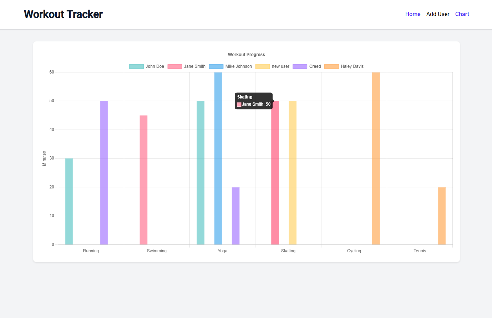
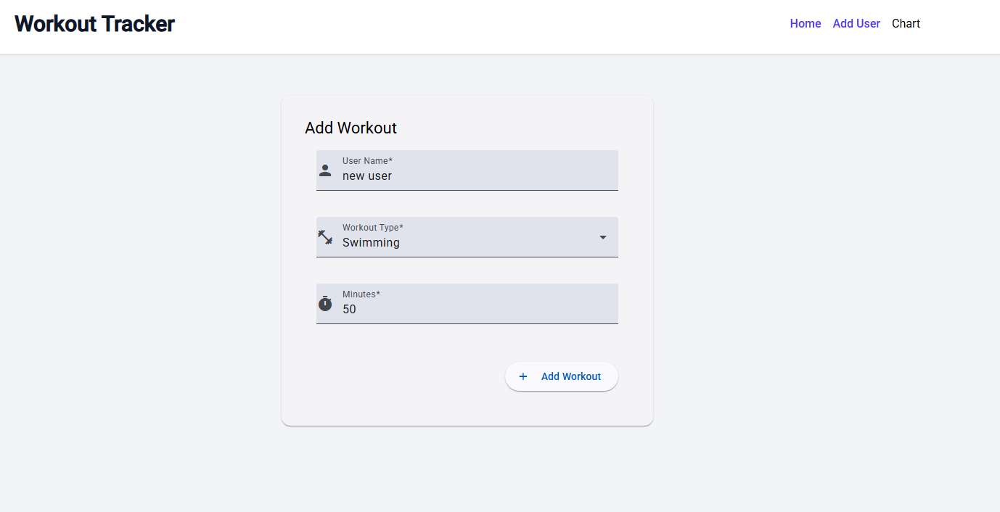
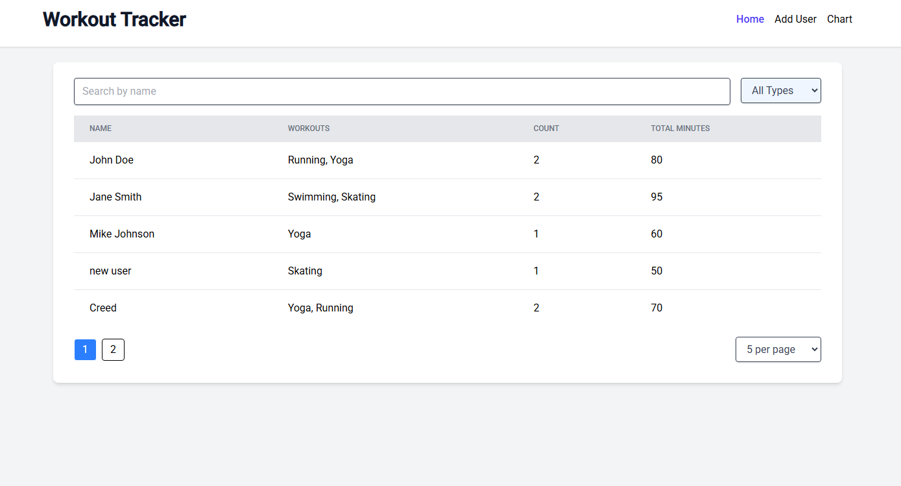
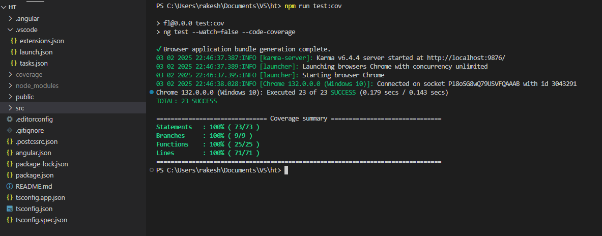

# **Workout Tracker SPA**  

## **Overview**  
This is a single-page application (SPA) built using **Angular 14+** that allows users to track their workouts. Users can enter their **name**, select a **workout type**, and specify the **duration** of their workout. The app provides features such as **search**, **filtering**, **pagination**, and **data persistence using localStorage**. Additionally, it includes **charts to visualize workout progress**.  

## **Features**  

✅ Add user workouts (User Name, Workout Type, and Minutes)  
✅ Display workouts in a table grid  
✅ Search workouts by user name  
✅ Filter workouts by workout type  
✅ Pagination for more than 5 users  
✅ Store data using localStorage  
✅ Preloaded with 3 default users  
✅ Unit tests for 1 component & 1 service (100% code coverage)  
✅ Hosted on Vercel
✅ Bonus: Charts for workout progress  

## **Screenshots**  

### **Application UI**  
  



### **Unit Test Coverage Report**  
  

---

## **Tech Stack**  

- **Angular 14+** (Frontend Framework)  
- **Tailwind CSS** (Styling)  
- **Angular Material & PrimeNG** (UI Components)  
- **Chart.js & ng2-charts** (Charts)  
- **Jest/Karma** (Unit Testing)  

---

## **Installation & Setup**  

### **1. Clone the Repository**  
```bash
git clone https://github.com/yourusername/workout-tracker.git
cd workout-tracker
```

### **2. Installation** 
```bash
npm install
```

### **3. Run it locally** 
```bash
ng serve
```
